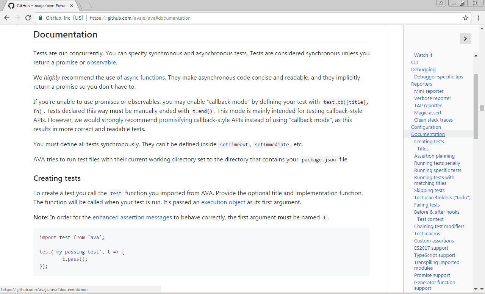
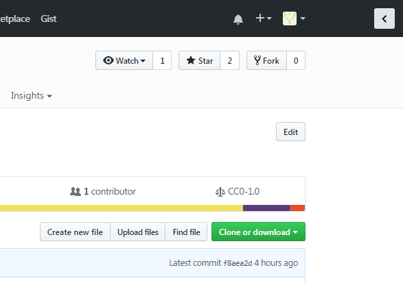

# GitHub Markdown Table of Contents

[](https://circleci.com/gh/otariidae/github-markdown-toc)
[](https://codecov.io/gh/otariidae/github-markdown-toc)
[](https://github.com/otariidae/github-markdown-toc/releases)
[](http://creativecommons.org/publicdomain/zero/1.0/)
[](https://standardjs.com/)
[](https://github.com/prettier/prettier)

Chrome extension to show a table of contents on GitHub.\
No more scrolling to read long long long documents.

\
_An example of a long readme with this extension -- AVA: a nice test runner for Node.js_

Works with:

- README on the top pages
- Markdown files
- Wikis
- Commented tags in release pages

## Install

You can install the latest version manually.

To install it, follow these steps:

1.  Download **github-markdown-toc.zip** from
    [the release page](https://github.com/otariidae/github-markdown-toc/releases)
    and unzip it.
2.  Visit **chrome://extensions**.
3.  Click to check **Developer mode**.
4.  Click **Load unpacked extension...**.
5.  In the file-selection dialog, select the unzipped directory.

For more information, see
[Chrome Extension Get Started](https://developer.chrome.com/extensions/getstarted#unpacked)
or [Google Chrome FAQ](https://developer.chrome.com/extensions/faq#faq-dev-01).

## Usage

To show or hide the table of contents, click the button on the top right-hand
corner.\
When a table of contents is not generated, the button is disabled.



## Permissions

```json
"permissions": [
  "https://github.com/*"
]
```

- `https://github.com/*` is used to run scripts on GitHub.

## Recommended environment

- the latest stable version of Google Chrome

## License

CC0\
[](http://creativecommons.org/publicdomain/zero/1.0/)
