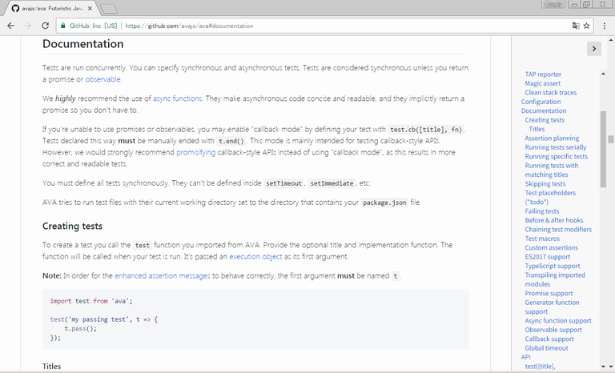

# GitHub Markdown Tabele of Contents

Chrome extension to show a table of contents on GitHub

## Install
You can install the latest version manually.

1. Clone this repository.
2. Visit chrome://extensions.
3. Click to check *Developer mode*.
4. Click *Load unpacked extension...*.
5. Select the *dist* directory.

For more info, see [Chrome Extension Get Started](https://developer.chrome.com/extensions/getstarted#unpacked) or [Google Chrome FAQ](https://developer.chrome.com/extensions/faq#faq-dev-01).

## Usage
Click the button on the top right-hand corner to show or hide the table of contents.

## Permissions
This extension uses _https://github.com/*_, *contentSettings* and *tabs*.  
- _https://github.com/*_ is used to run scripts on GitHub.
- *contentSettings* and *tabs* are used to know whether JavaScript is enabled in the tab or not.

## License
CC0  

